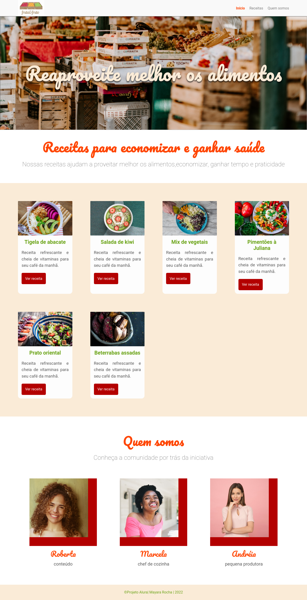

# Arquitetura CSS Alura
Projeto proposto pela [Alura](https://www.alura.com.br/) com a finalizade de estudar css o tema de Receitas para economizar.

 **Aprendizados**
  1. Organização de seus arquivos CSS.
  2. Arquiteturas CSS simples e robusta.
  3. Boas práticas e metodologias sobre CSS.
  4. Site responsivo.

`Veja o projeto finalizado`

### 🛠 Tecnologias

As seguintes ferramentas foram usadas na construção do projeto:

- [HTML](https://www.w3schools.com/html/)
- [CSS](https://www.w3schools.com/cssref/)

Feito com ❤️ por Mayara Rocha 👋🏽 Entre em contato!
 
 
   
